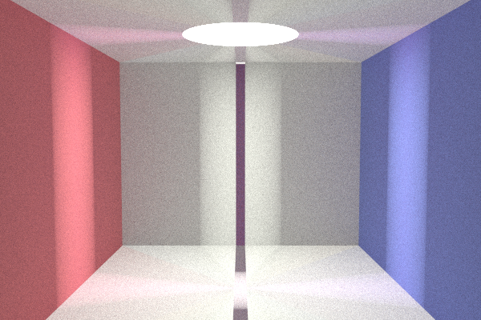

# Rust path tracer

To better understand the cgrpt path tracer, I ported it to Rust.

⚠️ Still has some bugs:

# Features

- Parallel path tracing using [rayon](https://crates.io/crates/rayon)
- Improved ergonomics, like estimated time to completion
- Idiomatic Rust constructs

# Performance

In my basic testing with only spheres, it performed equal or better than the C++ version.